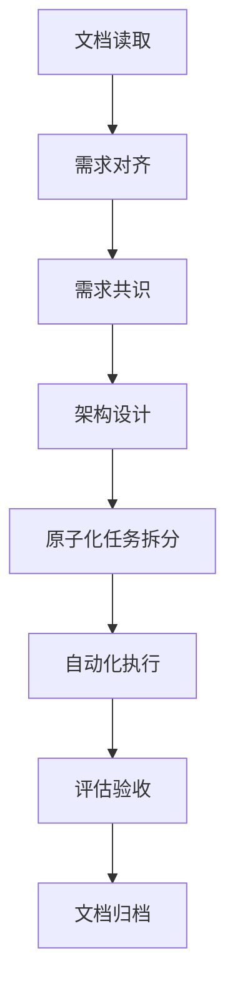

# HomeUp 需求共识文档

## 一、业务目标与需求描述

### 1.1 业务目标
- 建立完整的文档体系，覆盖产品、设计、技术、测试等各个方面
- 确保文档与代码的一致性，为开发和维护提供清晰的指导
- 提高项目的可维护性和可扩展性，为后续的功能迭代和技术升级做好准备
- 符合项目规则要求，通过文档审批，确保项目质量

### 1.2 需求描述
- 按照6A全流程工作流，补全项目所有缺失的文档
- 生成对齐阶段、架构设计阶段、原子化阶段、自动化执行阶段、评估验收阶段的相关文档
- 确保文档与代码的一致性，符合项目规则要求

## 二、用户场景与核心流程

### 2.1 用户场景

#### 2.1.1 开发人员
- **场景**：需要查阅文档了解项目架构和开发规范
- **需求**：文档清晰、详细，与代码一致
- **流程**：打开文档 → 查阅相关模块文档 → 了解开发规范 → 按照文档进行开发

#### 2.1.2 测试人员
- **场景**：需要查阅文档了解功能需求和测试用例
- **需求**：文档包含完整的功能说明和测试用例
- **流程**：打开文档 → 查阅产品需求文档 → 了解功能需求 → 查阅测试用例文档 → 执行测试

#### 2.1.3 产品人员
- **场景**：需要查阅文档了解产品需求和业务逻辑
- **需求**：文档包含完整的产品需求和业务流程
- **流程**：打开文档 → 查阅产品需求文档 → 了解业务逻辑 → 基于文档进行产品规划

#### 2.1.4 管理人员
- **场景**：需要查阅文档了解项目整体情况和进度
- **需求**：文档包含项目概述、进度计划和风险评估
- **流程**：打开文档 → 查阅最终交付报告 → 了解项目整体情况 → 基于文档进行管理决策

### 2.2 核心流程

## 三、可量化的验收标准

### 3.1 文档完整性
- 按照6A全流程工作流，生成所有必要的文档
- 文档覆盖产品、设计、技术、测试等各个方面
- 文档结构清晰，内容完整，无缺失项

### 3.2 文档一致性
- 文档与代码的一致性达到100%
- 文档之间的信息一致，无冲突
- 文档描述与实际实现一致

### 3.3 文档质量
- 文档格式规范，符合项目文档规范
- 文档内容清晰，逻辑连贯
- 文档包含必要的图表和示例

### 3.4 文档审批
- 所有关键文档通过人工审批
- 文档审批记录完整

## 四、产品与技术实现方案框架

### 4.1 产品方案
- **产品定位**：泛家居营销SaaS平台
- **核心功能**：客户管理、AI智能、营销工具、服务管理、订单管理、供应链管理等
- **目标用户**：导购员、门店管理者、总部运营人员
- **产品架构**：三端一体（导购端、门店端、总部端）

### 4.2 技术方案
- **技术栈**：Vue 3 + Vite + Pinia + Vue Router + Element Plus + Vant
- **架构设计**：模块化、组件化的前端架构
- **状态管理**：使用Pinia进行状态管理
- **路由管理**：使用Vue Router进行路由管理
- **API调用**：使用Axios进行API调用

## 五、技术与业务约束

### 5.1 技术约束
- 技术栈固定，不引入新的技术框架
- 文档与代码必须保持一致
- 文档格式必须符合项目规范

### 5.2 业务约束
- 不修改项目代码，仅补全文档
- 不添加新功能，仅完善现有文档体系
- 不改变项目架构，仅按照现有架构生成文档

## 六、任务边界限制

### 6.1 时间边界
- 任务时间：2026-04-03 至 2026-04-05
- 文档补全工作必须在规定时间内完成

### 6.2 范围边界
- 仅补全项目文档，不修改代码
- 仅完善现有文档体系，不添加新功能
- 仅按照现有架构生成文档，不改变项目架构

### 6.3 质量边界
- 文档必须符合项目规则要求
- 文档必须与代码保持一致
- 文档必须通过人工审批

## 七、关键假设与确认记录

| 序号 | 假设 | 确认状态 | 确认时间 | 确认人 |
|------|------|----------|----------|--------|
| 1 | 项目代码结构完整，功能模块齐全 | 已确认 | 2026-04-03 | AI自动执行 |
| 2 | 现有文档（开发指南、设计规范、项目架构）内容准确 | 已确认 | 2026-04-03 | AI自动执行 |
| 3 | 文档补全工作不需要修改代码 | 已确认 | 2026-04-03 | AI自动执行 |
| 4 | 文档存储路径按照项目规则要求 | 已确认 | 2026-04-03 | AI自动执行 |
| 5 | 文档审批流程按照项目规则要求 | 已确认 | 2026-04-03 | AI自动执行 |

## 八、需求变更管控规则

### 8.1 变更流程
- 需求变更必须经过审批
- 变更后必须更新相应的文档
- 变更记录必须完整

### 8.2 变更范围
- 仅允许文档内容的调整，不允许功能变更
- 仅允许文档格式的优化，不允许架构变更

### 8.3 变更记录
- 变更必须记录在文档修改历史中
- 变更记录必须包含变更时间、变更内容、变更原因
