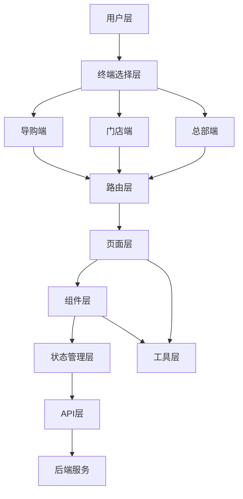
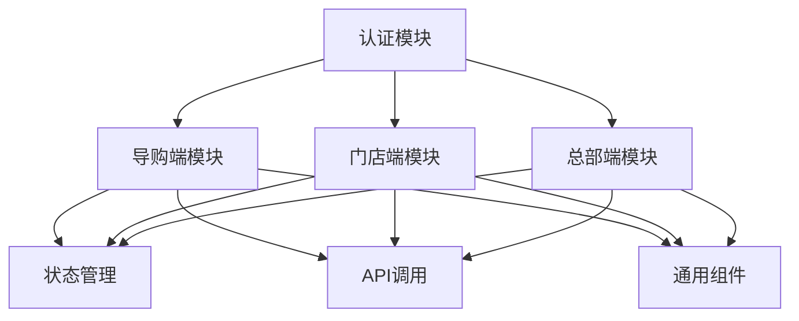
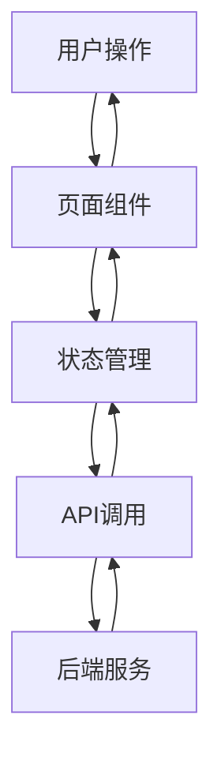

# HomeUp 技术架构设计文档

## 一、整体架构图

## 二、系统分层设计与核心组件定义

### 2.1 分层设计

| 层次 | 职责 | 技术实现 | 核心文件 |
|------|------|----------|----------|
| 用户层 | 用户交互 | 浏览器/移动端 | - |
| 终端选择层 | 终端选择 | Vue组件 | `src/views/auth/TerminalSelect.vue` |
| 路由层 | 页面导航 | Vue Router | `src/router/index.js` |
| 页面层 | 页面展示 | Vue组件 | `src/views/` |
| 组件层 | 可复用组件 | Vue组件 | `src/components/` |
| 状态管理层 | 状态管理 | Pinia | `src/stores/` |
| API层 | 数据交互 | Axios | - |
| 工具层 | 通用工具 | JavaScript | `src/utils/` |
| 后端服务 | 业务逻辑 | - | - |

### 2.2 核心组件定义

#### 2.2.1 通用组件
- **Card.vue**：卡片组件，用于展示信息
- **CustomButton.vue**：自定义按钮组件
- **GuideLayout.vue**：导购端布局组件
- **HeadquartersLayout.vue**：总部端布局组件
- **NavBar.vue**：导航栏组件
- **SearchBar.vue**：搜索栏组件
- **ShareComponent.vue**：分享组件
- **StoreLayout.vue**：门店端布局组件

#### 2.2.2 页面组件
- **认证模块**：
  - `Login.vue`：登录页面
  - `TerminalSelect.vue`：终端选择页面

- **导购端模块**：
  - `dashboard/Index.vue`：工作台
  - `customers/`：客户管理
  - `ai/`：AI智能
  - `referral/`：转介绍
  - `tickets/`：工单管理
  - `products/`：产品管理
  - `profile/`：个人中心

- **门店端模块**：
  - `dashboard/Index.vue`：工作台
  - `customers/`：客户管理
  - `orders/`：订单管理
  - `service/`：服务管理
  - `marketing/`：营销管理
  - `purchase/`：采购管理
  - `finance/`：财务管理

- **总部端模块**：
  - `Home.vue`：首页
  - `data/`：数据中心
  - `marketing/`：品牌运营
  - `supply/`：供应链管理
  - `stores/`：门店管理
  - `finance/`：财务管理
  - `training/`：培训赋能
  - `system/`：系统设置

## 三、模块依赖关系图

## 四、接口契约完整定义

### 4.1 认证接口

| 接口名称 | 请求方式 | URL | 入参 | 出参 | 错误码 | 权限要求 |
|---------|----------|-----|------|------|--------|----------|
| 登录 | POST | /api/auth/login | `{username: string, password: string, terminal: string}` | `{token: string, user: object}` | 401: 用户名或密码错误 | 无 |
| 登出 | POST | /api/auth/logout | `{token: string}` | `{success: boolean}` | 401: 未授权 | 已登录 |
| 刷新令牌 | POST | /api/auth/refresh | `{token: string}` | `{token: string}` | 401: 未授权 | 已登录 |

### 4.2 客户接口

| 接口名称 | 请求方式 | URL | 入参 | 出参 | 错误码 | 权限要求 |
|---------|----------|-----|------|------|--------|----------|
| 客户列表 | GET | /api/customers | `{page: number, size: number, keyword: string}` | `{list: array, total: number}` | 401: 未授权 | 已登录 |
| 客户详情 | GET | /api/customers/{id} | `{id: number}` | `{customer: object}` | 404: 客户不存在 | 已登录 |
| 客户跟进 | POST | /api/customers/{id}/follow | `{id: number, content: string}` | `{success: boolean}` | 404: 客户不存在 | 已登录 |

### 4.3 订单接口

| 接口名称 | 请求方式 | URL | 入参 | 出参 | 错误码 | 权限要求 |
|---------|----------|-----|------|------|--------|----------|
| 订单列表 | GET | /api/orders | `{page: number, size: number, status: string}` | `{list: array, total: number}` | 401: 未授权 | 已登录 |
| 订单详情 | GET | /api/orders/{id} | `{id: number}` | `{order: object}` | 404: 订单不存在 | 已登录 |
| 订单状态更新 | PUT | /api/orders/{id}/status | `{id: number, status: string}` | `{success: boolean}` | 404: 订单不存在 | 已登录 |

### 4.4 服务接口

| 接口名称 | 请求方式 | URL | 入参 | 出参 | 错误码 | 权限要求 |
|---------|----------|-----|------|------|--------|----------|
| 工单列表 | GET | /api/tickets | `{page: number, size: number, status: string}` | `{list: array, total: number}` | 401: 未授权 | 已登录 |
| 工单详情 | GET | /api/tickets/{id} | `{id: number}` | `{ticket: object}` | 404: 工单不存在 | 已登录 |
| 工单处理 | PUT | /api/tickets/{id}/process | `{id: number, status: string, content: string}` | `{success: boolean}` | 404: 工单不存在 | 已登录 |

### 4.5 营销接口

| 接口名称 | 请求方式 | URL | 入参 | 出参 | 错误码 | 权限要求 |
|---------|----------|-----|------|------|--------|----------|
| 转介绍列表 | GET | /api/referrals | `{page: number, size: number}` | `{list: array, total: number}` | 401: 未授权 | 已登录 |
| 活动列表 | GET | /api/activities | `{page: number, size: number}` | `{list: array, total: number}` | 401: 未授权 | 已登录 |
| 短信发送 | POST | /api/sms/send | `{phone: string, content: string}` | `{success: boolean}` | 400: 参数错误 | 已登录 |

### 4.6 数据接口

| 接口名称 | 请求方式 | URL | 入参 | 出参 | 错误码 | 权限要求 |
|---------|----------|-----|------|------|--------|----------|
| 销售数据 | GET | /api/data/sales | `{startDate: string, endDate: string}` | `{data: array}` | 401: 未授权 | 已登录 |
| 客户数据 | GET | /api/data/customers | `{startDate: string, endDate: string}` | `{data: array}` | 401: 未授权 | 已登录 |
| 门店数据 | GET | /api/data/stores | `{startDate: string, endDate: string}` | `{data: array}` | 401: 未授权 | 已登录 |

## 五、核心业务数据流向图

## 六、数据库表结构设计

### 6.1 用户表（users）

| 字段名 | 字段类型 | 索引 | 描述 |
|-------|---------|------|------|
| id | INT | PRIMARY KEY | 用户ID |
| username | VARCHAR(50) | UNIQUE | 用户名 |
| password | VARCHAR(100) | - | 密码 |
| name | VARCHAR(50) | - | 姓名 |
| phone | VARCHAR(20) | - | 手机号 |
| terminal | VARCHAR(20) | - | 终端类型 |
| role | VARCHAR(20) | - | 角色 |
| created_at | TIMESTAMP | - | 创建时间 |
| updated_at | TIMESTAMP | - | 更新时间 |

### 6.2 客户表（customers）

| 字段名 | 字段类型 | 索引 | 描述 |
|-------|---------|------|------|
| id | INT | PRIMARY KEY | 客户ID |
| name | VARCHAR(50) | - | 姓名 |
| phone | VARCHAR(20) | UNIQUE | 手机号 |
| address | VARCHAR(200) | - | 地址 |
| source | VARCHAR(50) | - | 客户来源 |
| status | VARCHAR(20) | - | 客户状态 |
| created_at | TIMESTAMP | - | 创建时间 |
| updated_at | TIMESTAMP | - | 更新时间 |

### 6.3 订单表（orders）

| 字段名 | 字段类型 | 索引 | 描述 |
|-------|---------|------|------|
| id | INT | PRIMARY KEY | 订单ID |
| customer_id | INT | FOREIGN KEY | 客户ID |
| amount | DECIMAL(10,2) | - | 订单金额 |
| status | VARCHAR(20) | - | 订单状态 |
| created_at | TIMESTAMP | - | 创建时间 |
| updated_at | TIMESTAMP | - | 更新时间 |

### 6.4 工单表（tickets）

| 字段名 | 字段类型 | 索引 | 描述 |
|-------|---------|------|------|
| id | INT | PRIMARY KEY | 工单ID |
| customer_id | INT | FOREIGN KEY | 客户ID |
| type | VARCHAR(50) | - | 工单类型 |
| status | VARCHAR(20) | - | 工单状态 |
| content | TEXT | - | 工单内容 |
| created_at | TIMESTAMP | - | 创建时间 |
| updated_at | TIMESTAMP | - | 更新时间 |

### 6.5 转介绍表（referrals）

| 字段名 | 字段类型 | 索引 | 描述 |
|-------|---------|------|------|
| id | INT | PRIMARY KEY | 转介绍ID |
| referrer_id | INT | FOREIGN KEY | 推荐人ID |
| referee_id | INT | FOREIGN KEY | 被推荐人ID |
| status | VARCHAR(20) | - | 转介绍状态 |
| reward | DECIMAL(10,2) | - | 奖励金额 |
| created_at | TIMESTAMP | - | 创建时间 |
| updated_at | TIMESTAMP | - | 更新时间 |

## 七、全局异常处理策略

### 7.1 前端异常处理
- **API错误处理**：统一捕获API错误，显示错误提示
- **页面错误处理**：使用ErrorBoundary组件捕获页面错误
- **网络错误处理**：检测网络状态，显示网络异常提示
- **用户输入错误处理**：实时验证用户输入，显示错误提示

### 7.2 后端异常处理
- **业务逻辑错误**：返回400错误，包含错误信息
- **认证错误**：返回401错误，要求重新登录
- **权限错误**：返回403错误，提示无权限
- **资源不存在错误**：返回404错误，提示资源不存在
- **服务器错误**：返回500错误，提示服务器异常

## 八、降级兜底方案

### 8.1 前端降级方案
- **静态资源降级**：使用CDN缓存静态资源
- **API降级**：使用本地缓存数据
- **功能降级**：禁用非核心功能，保证核心功能可用
- **页面降级**：使用简化版页面

### 8.2 后端降级方案
- **服务降级**：禁用非核心服务
- **数据库降级**：使用只读模式
- **缓存降级**：使用本地缓存

## 九、重试与幂等设计

### 9.1 重试机制
- **网络请求重试**：对网络错误进行自动重试
- **API调用重试**：对临时错误进行自动重试
- **定时任务重试**：对失败的定时任务进行重试

### 9.2 幂等设计
- **API幂等性**：使用唯一ID确保API调用的幂等性
- **数据库操作幂等性**：使用事务和唯一约束确保数据库操作的幂等性
- **消息队列幂等性**：使用消息ID确保消息处理的幂等性

## 十、安全设计与合规适配方案

### 10.1 前端安全
- **XSS防护**：使用Vue的内置防护机制
- **CSRF防护**：使用token验证
- **输入验证**：前端验证用户输入
- **敏感信息保护**：不在前端存储敏感信息

### 10.2 后端安全
- **认证授权**：使用JWT进行认证
- **密码加密**：使用bcrypt加密密码
- **SQL注入防护**：使用参数化查询
- **API权限控制**：基于角色的权限控制

### 10.3 合规适配
- **数据隐私**：遵守数据隐私法规
- **数据存储**：符合数据存储要求
- **用户协议**：提供用户协议和隐私政策

## 十一、性能优化方案

### 11.1 前端性能优化
- **代码分割**：使用动态导入，按需加载组件
- **组件懒加载**：减少初始加载时间
- **Tree Shaking**：移除未使用的代码
- **图片懒加载**：使用loading="lazy"属性
- **缓存策略**：合理使用localStorage和sessionStorage

### 11.2 后端性能优化
- **API缓存**：缓存热点数据
- **数据库优化**：使用索引，优化查询
- **服务器优化**：使用CDN，负载均衡

### 11.3 网络优化
- **HTTP/2**：使用HTTP/2协议
- **压缩**：压缩静态资源
- **减少请求**：合并请求，使用SPAs
