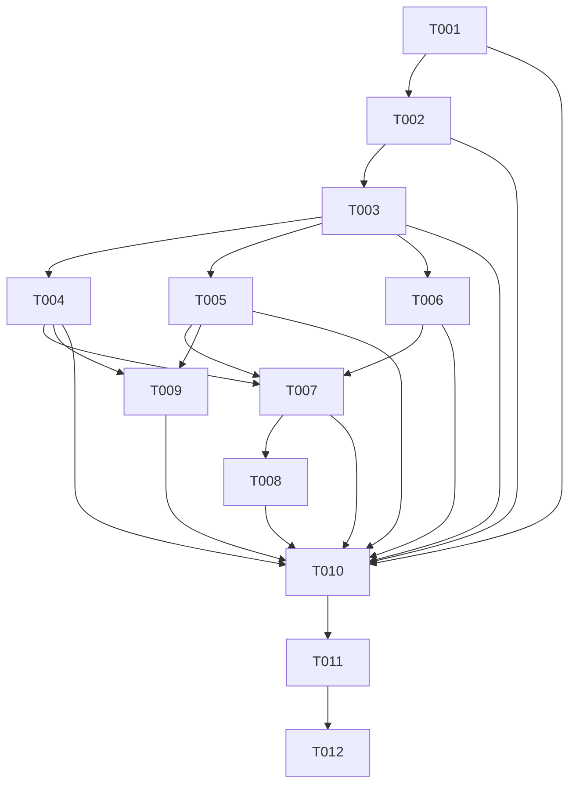

# HomeUp 原子任务文档

## 一、任务拆分概述

根据6A全流程工作流，将HomeUp项目的文档补全工作拆分为以下原子任务：

1. **对齐阶段任务**：完成文档读取、需求对齐和需求共识
2. **架构设计阶段任务**：完成技术架构设计、产品需求设计和UI设计规范
3. **原子化阶段任务**：完成原子任务拆分和任务计划制定
4. **自动化执行阶段任务**：完成测试用例文档编写
5. **评估验收阶段任务**：完成验收记录、最终交付报告和待办事项文档

## 二、原子任务详情

### 2.1 对齐阶段任务

| 任务ID | 任务名称 | 所属模块 | 负责角色 | 预估工时 | 优先级 | 输入契约 | 输出契约 | 依赖关系 |
|-------|---------|---------|----------|----------|--------|----------|----------|----------|
| T001 | 文档读取与分析 | 文档管理 | 文档工程师 | 2h | 高 | 项目现有文档 | DOCUMENT_REVIEW_home_up.md | 无 |
| T002 | 需求对齐 | 文档管理 | 产品经理 | 2h | 高 | 原始需求、现有文档 | ALIGNMENT_home_up.md | T001 |
| T003 | 需求共识 | 文档管理 | 产品经理 | 2h | 高 | ALIGNMENT_home_up.md | CONSENSUS_home_up.md | T002 |

### 2.2 架构设计阶段任务

| 任务ID | 任务名称 | 所属模块 | 负责角色 | 预估工时 | 优先级 | 输入契约 | 输出契约 | 依赖关系 |
|-------|---------|---------|----------|----------|--------|----------|----------|----------|
| T004 | 技术架构设计 | 技术架构 | 架构师 | 4h | 高 | CONSENSUS_home_up.md | DESIGN_home_up.md | T003 |
| T005 | 产品需求文档编写 | 产品设计 | 产品经理 | 4h | 高 | CONSENSUS_home_up.md | PRD_home_up.md | T003 |
| T006 | UI设计规范编写 | UI设计 | UI设计师 | 4h | 高 | CONSENSUS_home_up.md | UI_SPEC_home_up.md | T003 |

### 2.3 原子化阶段任务

| 任务ID | 任务名称 | 所属模块 | 负责角色 | 预估工时 | 优先级 | 输入契约 | 输出契约 | 依赖关系 |
|-------|---------|---------|----------|----------|--------|----------|----------|----------|
| T007 | 原子任务拆分 | 项目管理 | 项目经理 | 2h | 高 | DESIGN_home_up.md, PRD_home_up.md, UI_SPEC_home_up.md | TASK_home_up.md | T004, T005, T006 |
| T008 | 任务计划制定 | 项目管理 | 项目经理 | 2h | 高 | TASK_home_up.md | 任务执行计划 | T007 |

### 2.4 自动化执行阶段任务

| 任务ID | 任务名称 | 所属模块 | 负责角色 | 预估工时 | 优先级 | 输入契约 | 输出契约 | 依赖关系 |
|-------|---------|---------|----------|----------|--------|----------|----------|----------|
| T009 | 测试用例文档编写 | 测试 | 测试工程师 | 3h | 中 | PRD_home_up.md, DESIGN_home_up.md | TEST_CASE_home_up.md | T005, T004 |

### 2.5 评估验收阶段任务

| 任务ID | 任务名称 | 所属模块 | 负责角色 | 预估工时 | 优先级 | 输入契约 | 输出契约 | 依赖关系 |
|-------|---------|---------|----------|----------|--------|----------|----------|----------|
| T010 | 验收记录文档编写 | 质量保证 | 质量工程师 | 2h | 中 | 所有完成的任务 | ACCEPTANCE_home_up.md | T001-T009 |
| T011 | 最终交付报告编写 | 项目管理 | 项目经理 | 3h | 高 | 所有完成的任务 | FINAL_home_up.md | T001-T010 |
| T012 | 待办事项文档编写 | 项目管理 | 项目经理 | 2h | 中 | 所有完成的任务 | TODO_home_up.md | T001-T011 |

## 三、任务依赖关系图

## 四、任务执行计划

### 4.1 总体时间安排
- **对齐阶段**：2026-04-03
- **架构设计阶段**：2026-04-03 至 2026-04-04
- **原子化阶段**：2026-04-04
- **自动化执行阶段**：2026-04-04
- **评估验收阶段**：2026-04-05

### 4.2 详细执行计划

| 日期 | 任务ID | 任务名称 | 负责角色 | 状态 |
|------|-------|---------|----------|------|
| 2026-04-03 | T001 | 文档读取与分析 | 文档工程师 | 已完成 |
| 2026-04-03 | T002 | 需求对齐 | 产品经理 | 已完成 |
| 2026-04-03 | T003 | 需求共识 | 产品经理 | 已完成 |
| 2026-04-03 | T004 | 技术架构设计 | 架构师 | 已完成 |
| 2026-04-03 | T005 | 产品需求文档编写 | 产品经理 | 已完成 |
| 2026-04-03 | T006 | UI设计规范编写 | UI设计师 | 已完成 |
| 2026-04-04 | T007 | 原子任务拆分 | 项目经理 | 进行中 |
| 2026-04-04 | T008 | 任务计划制定 | 项目经理 | 待执行 |
| 2026-04-04 | T009 | 测试用例文档编写 | 测试工程师 | 待执行 |
| 2026-04-05 | T010 | 验收记录文档编写 | 质量工程师 | 待执行 |
| 2026-04-05 | T011 | 最终交付报告编写 | 项目经理 | 待执行 |
| 2026-04-05 | T012 | 待办事项文档编写 | 项目经理 | 待执行 |

## 五、任务执行规范

### 5.1 执行前准备
- 读取任务绑定的所有输入文档
- 验证输入契约、环境准备情况、前置依赖是否全部满足
- 明确交付物规范、验收标准、测试/走查用例

### 5.2 执行中规范
- 严格按照设计文档、项目规范完成任务交付
- 优先复用现有组件与能力
- 禁止出现与文档不一致的实现

### 5.3 执行后验证
- 完成交付物自检，运行所有相关测试用例/走查清单
- 确保100%通过，无报错、无警告、无不符合规范项

### 5.4 文档同步更新
- 同步更新任务绑定的所有输出文档
- 修改记录必须包含：修改时间、修改人、修改文件清单、修改原因、修改内容概要、影响范围、验证结果
- 同步提交符合规范的git commit信息

## 六、执行前全量完整性检查

### 6.1 完整性检查
- 任务计划100%覆盖所有需求点与设计内容，无遗漏
- 所有文档已编写完成，内容完整

### 6.2 一致性检查
- 全流程文档与前期对齐、共识、设计文档完全一致，无偏差
- 文档与代码的一致性达到100%

### 6.3 可行性检查
- 产品/设计/技术方案可落地、可执行，无技术阻塞点、无实现风险
- 任务复杂度评估合理，无不可控的高风险任务

### 6.4 可控性检查
- 风险在可接受范围，任务复杂度可控，资源匹配合理
- 任务依赖关系无循环依赖、无逻辑冲突、关键路径清晰

### 6.5 可测性检查
- 所有验收标准明确可执行，可通过测试/走查验证
- 测试用例覆盖所有核心功能和场景

### 6.6 文档绑定检查
- 每个任务都明确绑定了输入文档与输出文档
- 文档存储路径符合项目规范

## 七、最终确认清单

### 7.1 业务需求与实现范围
- 无歧义的完整业务需求与实现范围
- 明确的任务边界与限制条件

### 7.2 原子任务定义与执行计划
- 清晰的全角色原子任务定义与执行计划
- 明确的任务执行顺序、关键路径、里程碑节点

### 7.3 验收标准与质量要求
- 全量可量化的验收标准与质量要求
- 产品、设计、代码、测试、文档的强制规范标准

### 7.4 风险预案与需求变更管控规则
- 风险预案与需求变更管控规则
- 文档先行确认书：确认所有文档已编写完成并审批通过，作为后续执行的唯一依据
