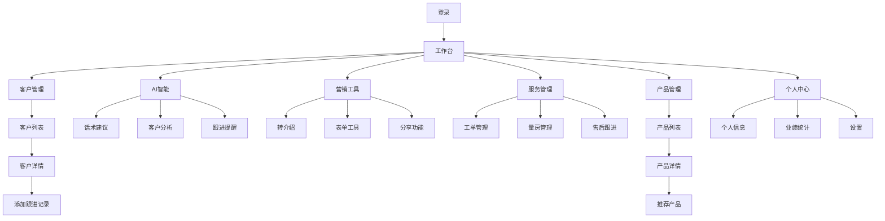
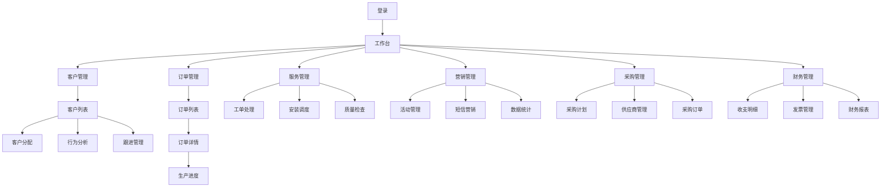
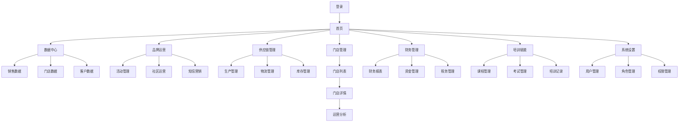
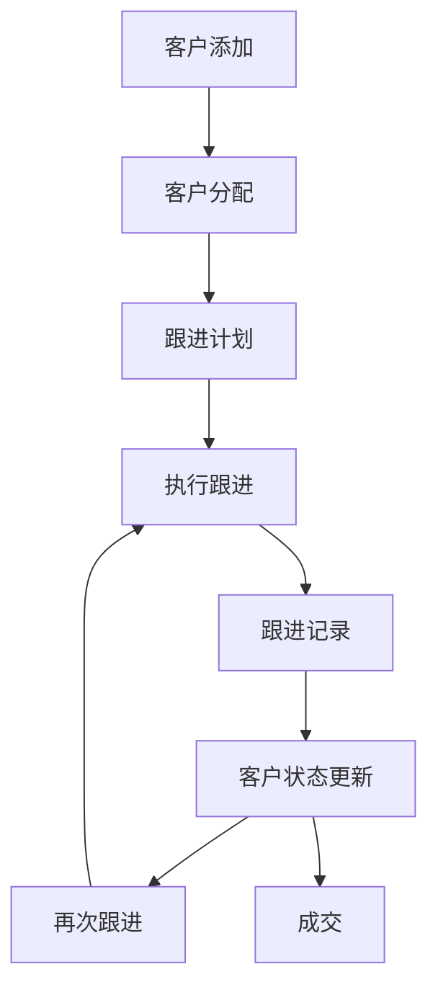
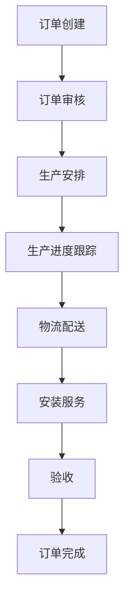
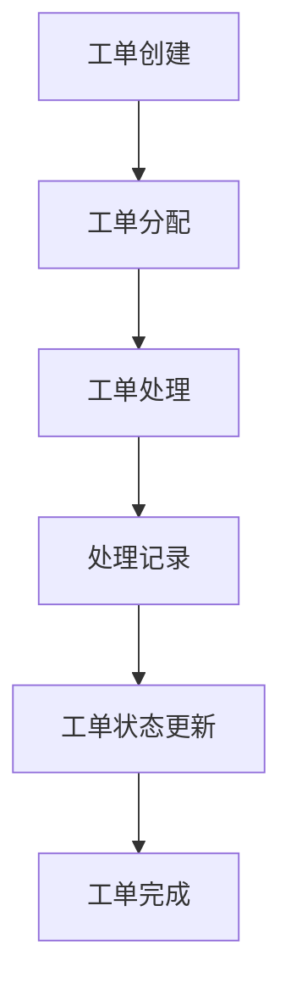

# HomeUp 产品需求文档

## 一、产品概述

### 1.1 产品定位
HomeUp是一个泛家居营销SaaS平台，旨在为泛家居行业提供一站式营销管理解决方案，帮助企业提升营销效率、优化客户管理、实现业务增长。

### 1.2 核心价值
- **提升营销效率**：通过AI智能、营销工具等功能，帮助企业提高营销效率
- **优化客户管理**：通过客户管理、跟进记录等功能，帮助企业更好地管理客户
- **实现业务增长**：通过数据分析、订单管理等功能，帮助企业实现业务增长
- **降低运营成本**：通过自动化流程、智能推荐等功能，帮助企业降低运营成本

### 1.3 目标用户
- **导购员**：负责客户开发、跟进、服务等工作
- **门店管理者**：负责门店运营、客户管理、订单管理等工作
- **总部运营人员**：负责品牌运营、数据分析、供应链管理等工作

## 二、功能说明

### 2.1 认证模块

#### 2.1.1 终端选择
- **功能**：用户选择登录终端（导购端、门店端、总部端）
- **操作流程**：打开应用 → 选择终端 → 进入登录页面
- **异常处理**：无

#### 2.1.2 登录
- **功能**：用户输入账号密码登录系统
- **操作流程**：输入用户名 → 输入密码 → 点击登录 → 进入系统
- **异常处理**：用户名或密码错误时，显示错误提示

### 2.2 导购端

#### 2.2.1 工作台
- **功能**：数据概览、快捷功能、待办事项
- **操作流程**：登录系统 → 进入工作台 → 查看数据概览 → 点击快捷功能 → 处理待办事项
- **异常处理**：无

#### 2.2.2 客户管理
- **功能**：客户列表、客户详情、跟进记录
- **操作流程**：进入客户管理 → 查看客户列表 → 点击客户详情 → 查看跟进记录 → 添加跟进记录
- **异常处理**：无

#### 2.2.3 AI智能
- **功能**：话术建议、客户分析、跟进提醒
- **操作流程**：进入AI智能 → 查看话术建议 → 查看客户分析 → 查看跟进提醒
- **异常处理**：无

#### 2.2.4 营销工具
- **功能**：转介绍、表单工具、分享功能
- **操作流程**：进入营销工具 → 选择转介绍 → 生成分享海报 → 分享给客户
- **异常处理**：无

#### 2.2.5 服务管理
- **功能**：工单管理、量房管理、售后跟进
- **操作流程**：进入服务管理 → 查看工单列表 → 处理工单 → 记录处理结果
- **异常处理**：无

#### 2.2.6 产品管理
- **功能**：产品列表、产品详情、产品推荐
- **操作流程**：进入产品管理 → 查看产品列表 → 点击产品详情 → 推荐产品给客户
- **异常处理**：无

#### 2.2.7 个人中心
- **功能**：个人信息、业绩统计、设置
- **操作流程**：进入个人中心 → 查看个人信息 → 查看业绩统计 → 修改设置
- **异常处理**：无

### 2.3 门店端

#### 2.3.1 工作台
- **功能**：门店数据、销售趋势、待办事项
- **操作流程**：登录系统 → 进入工作台 → 查看门店数据 → 查看销售趋势 → 处理待办事项
- **异常处理**：无

#### 2.3.2 客户管理
- **功能**：客户分配、行为分析、跟进管理
- **操作流程**：进入客户管理 → 查看客户列表 → 分配客户 → 查看客户行为分析 → 管理跟进记录
- **异常处理**：无

#### 2.3.3 订单管理
- **功能**：订单列表、订单详情、生产进度
- **操作流程**：进入订单管理 → 查看订单列表 → 点击订单详情 → 查看生产进度
- **异常处理**：无

#### 2.3.4 服务管理
- **功能**：工单处理、安装调度、质量检查
- **操作流程**：进入服务管理 → 查看工单列表 → 处理工单 → 调度安装师傅 → 记录质量检查结果
- **异常处理**：无

#### 2.3.5 营销管理
- **功能**：活动管理、短信营销、数据统计
- **操作流程**：进入营销管理 → 查看活动列表 → 创建活动 → 发送短信 → 查看数据统计
- **异常处理**：无

#### 2.3.6 采购管理
- **功能**：采购计划、供应商管理、采购订单
- **操作流程**：进入采购管理 → 制定采购计划 → 管理供应商 → 创建采购订单
- **异常处理**：无

#### 2.3.7 财务管理
- **功能**：收支明细、发票管理、财务报表
- **操作流程**：进入财务管理 → 查看收支明细 → 管理发票 → 查看财务报表
- **异常处理**：无

### 2.4 总部端

#### 2.4.1 数据中心
- **功能**：销售数据、门店数据、客户数据
- **操作流程**：进入数据中心 → 查看销售数据 → 查看门店数据 → 查看客户数据
- **异常处理**：无

#### 2.4.2 品牌运营
- **功能**：活动管理、社区运营、短信营销
- **操作流程**：进入品牌运营 → 创建活动 → 管理社区 → 发送短信
- **异常处理**：无

#### 2.4.3 供应链管理
- **功能**：生产管理、物流管理、库存管理
- **操作流程**：进入供应链管理 → 查看生产进度 → 管理物流 → 查看库存
- **异常处理**：无

#### 2.4.4 门店管理
- **功能**：门店列表、门店详情、运营分析
- **操作流程**：进入门店管理 → 查看门店列表 → 点击门店详情 → 查看运营分析
- **异常处理**：无

#### 2.4.5 财务管理
- **功能**：财务报表、资金管理、税务管理
- **操作流程**：进入财务管理 → 查看财务报表 → 管理资金 → 处理税务
- **异常处理**：无

#### 2.4.6 培训赋能
- **功能**：课程管理、考试管理、培训记录
- **操作流程**：进入培训赋能 → 管理课程 → 创建考试 → 查看培训记录
- **异常处理**：无

#### 2.4.7 系统设置
- **功能**：用户管理、角色管理、权限管理
- **操作流程**：进入系统设置 → 管理用户 → 管理角色 → 设置权限
- **异常处理**：无

## 三、用户操作流程

### 3.1 导购端操作流程

### 3.2 门店端操作流程

### 3.3 总部端操作流程

## 四、异常处理规则

### 4.1 认证异常
- **用户名或密码错误**：显示错误提示，提示用户重新输入
- **账号被锁定**：显示错误提示，提示用户联系管理员
- **网络异常**：显示网络异常提示，建议用户检查网络连接

### 4.2 操作异常
- **权限不足**：显示权限不足提示，禁止用户操作
- **数据不存在**：显示数据不存在提示，引导用户返回
- **操作失败**：显示操作失败提示，提示用户重试

### 4.3 系统异常
- **服务器异常**：显示服务器异常提示，建议用户稍后重试
- **系统维护**：显示系统维护提示，告知用户维护时间

## 五、权限管控规则

### 5.1 导购端权限
- **客户管理**：查看、添加、编辑客户信息
- **服务管理**：处理工单、记录服务情况
- **营销工具**：使用转介绍、表单工具等功能
- **个人中心**：查看个人信息、业绩统计

### 5.2 门店端权限
- **客户管理**：查看、分配、管理客户
- **订单管理**：查看、处理订单
- **服务管理**：处理工单、调度安装师傅
- **营销管理**：创建活动、发送短信
- **采购管理**：制定采购计划、管理供应商
- **财务管理**：查看财务报表、管理发票

### 5.3 总部端权限
- **数据中心**：查看所有数据
- **品牌运营**：创建活动、管理社区
- **供应链管理**：管理生产、物流、库存
- **门店管理**：管理所有门店
- **财务管理**：管理所有财务
- **培训赋能**：管理课程、考试
- **系统设置**：管理用户、角色、权限

## 六、核心业务流程图

### 6.1 客户跟进流程

### 6.2 订单处理流程

### 6.3 工单处理流程

## 七、用户旅程图

### 7.1 导购员用户旅程

| 阶段 | 行为 | 触点 | 情感 | 痛点 | 解决方案 |
|------|------|------|------|------|----------|
| 客户开发 | 寻找潜在客户 | 营销工具 | 期待 | 客户资源少 | 转介绍功能、表单工具 |
| 客户跟进 | 与客户沟通 | 客户管理 | 积极 | 跟进不及时 | AI跟进提醒、话术建议 |
| 服务提供 | 处理客户需求 | 服务管理 | 专业 | 服务流程复杂 | 工单管理、量房管理 |
| 业绩管理 | 查看个人业绩 | 个人中心 | 自豪 | 业绩统计复杂 | 业绩统计功能 |

### 7.2 门店管理者用户旅程

| 阶段 | 行为 | 触点 | 情感 | 痛点 | 解决方案 |
|------|------|------|------|------|----------|
| 门店运营 | 管理门店日常 | 工作台 | 忙碌 | 数据不清晰 | 数据概览、销售趋势 |
| 客户管理 | 分配客户资源 | 客户管理 | 公平 | 客户分配不均 | 客户分配功能 |
| 订单管理 | 处理订单 | 订单管理 | 高效 | 订单跟踪困难 | 订单详情、生产进度 |
| 财务管理 | 管理门店财务 | 财务管理 | 谨慎 | 财务报表复杂 | 财务报表功能 |

### 7.3 总部运营人员用户旅程

| 阶段 | 行为 | 触点 | 情感 | 痛点 | 解决方案 |
|------|------|------|------|------|----------|
| 数据分析 | 分析业务数据 | 数据中心 | 洞察 | 数据分散 | 销售数据、门店数据、客户数据 |
| 品牌运营 | 开展营销活动 | 品牌运营 | 创新 | 活动效果难评估 | 活动管理、数据统计 |
| 供应链管理 | 管理供应链 | 供应链管理 | 协调 | 供应链效率低 | 生产管理、物流管理、库存管理 |
| 系统管理 | 管理系统设置 | 系统设置 | 控制 | 权限管理复杂 | 用户管理、角色管理、权限管理 |

## 八、数据模型与字段定义

### 8.1 用户模型

| 字段名 | 类型 | 描述 | 约束 |
|-------|------|------|------|
| id | Integer | 用户ID | 主键 |
| username | String | 用户名 | 唯一 |
| password | String | 密码 | 加密存储 |
| name | String | 姓名 | 必填 |
| phone | String | 手机号 | 必填 |
| terminal | String | 终端类型 | 必填 |
| role | String | 角色 | 必填 |
| created_at | Timestamp | 创建时间 | - |
| updated_at | Timestamp | 更新时间 | - |

### 8.2 客户模型

| 字段名 | 类型 | 描述 | 约束 |
|-------|------|------|------|
| id | Integer | 客户ID | 主键 |
| name | String | 姓名 | 必填 |
| phone | String | 手机号 | 唯一 |
| address | String | 地址 | - |
| source | String | 客户来源 | - |
| status | String | 客户状态 | - |
| created_at | Timestamp | 创建时间 | - |
| updated_at | Timestamp | 更新时间 | - |

### 8.3 订单模型

| 字段名 | 类型 | 描述 | 约束 |
|-------|------|------|------|
| id | Integer | 订单ID | 主键 |
| customer_id | Integer | 客户ID | 外键 |
| amount | Decimal | 订单金额 | 必填 |
| status | String | 订单状态 | 必填 |
| created_at | Timestamp | 创建时间 | - |
| updated_at | Timestamp | 更新时间 | - |

### 8.4 工单模型

| 字段名 | 类型 | 描述 | 约束 |
|-------|------|------|------|
| id | Integer | 工单ID | 主键 |
| customer_id | Integer | 客户ID | 外键 |
| type | String | 工单类型 | 必填 |
| status | String | 工单状态 | 必填 |
| content | Text | 工单内容 | 必填 |
| created_at | Timestamp | 创建时间 | - |
| updated_at | Timestamp | 更新时间 | - |

### 8.5 转介绍模型

| 字段名 | 类型 | 描述 | 约束 |
|-------|------|------|------|
| id | Integer | 转介绍ID | 主键 |
| referrer_id | Integer | 推荐人ID | 外键 |
| referee_id | Integer | 被推荐人ID | 外键 |
| status | String | 转介绍状态 | 必填 |
| reward | Decimal | 奖励金额 | - |
| created_at | Timestamp | 创建时间 | - |
| updated_at | Timestamp | 更新时间 | - |

## 九、报表与埋点需求

### 9.1 报表需求
- **销售报表**：按时间、门店、产品等维度统计销售数据
- **客户报表**：按客户来源、状态等维度统计客户数据
- **服务报表**：按工单类型、状态等维度统计服务数据
- **营销报表**：按活动、渠道等维度统计营销数据

### 9.2 埋点需求
- **用户行为埋点**：记录用户登录、操作等行为
- **功能使用埋点**：记录各功能的使用情况
- **页面访问埋点**：记录页面访问次数、停留时间等
- **异常行为埋点**：记录系统异常、操作失败等情况

## 十、合规适配方案

### 10.1 数据隐私
- **数据加密**：对敏感数据进行加密存储
- **数据访问控制**：严格控制数据访问权限
- **数据脱敏**：在非必要场景下对敏感数据进行脱敏处理

### 10.2 合规要求
- **用户协议**：提供用户协议和隐私政策
- **数据存储**：符合数据存储要求
- **数据备份**：定期备份数据，确保数据安全
- **数据删除**：提供数据删除功能，符合数据删除要求

## 十一、非功能需求

### 11.1 性能需求
- **响应时间**：页面加载时间 < 2秒
- **并发处理**：支持1000+用户同时在线
- **数据处理**：支持大数据量的处理和分析

### 11.2 安全需求
- **认证安全**：使用JWT进行认证
- **数据安全**：对敏感数据进行加密
- **接口安全**：对API接口进行权限控制

### 11.3 可用性需求
- **系统可用性**：99.9%以上
- **故障恢复**：故障后30分钟内恢复
- **备份策略**：每日备份数据

### 11.4 可扩展性需求
- **模块扩展**：支持功能模块的扩展
- **技术扩展**：支持技术栈的升级
- **业务扩展**：支持业务的快速迭代
