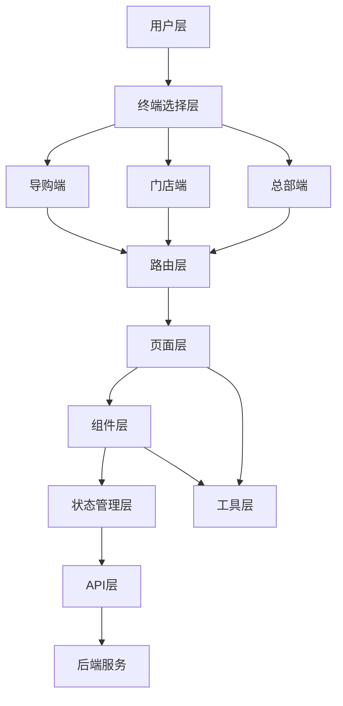
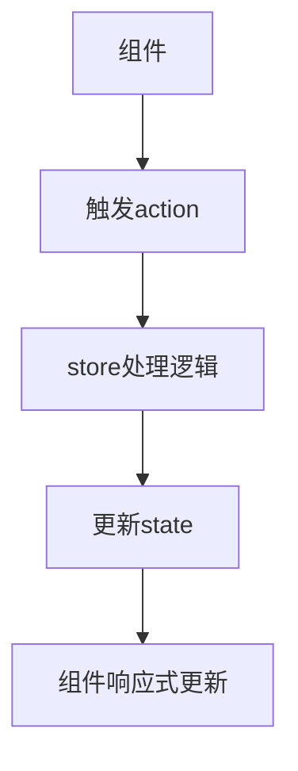

# HomeUp 项目架构文档

## 一、架构总览

HomeUp 采用现代化的前端架构，基于 Vue 3 + Vite + Pinia 技术栈，实现了三端一体的泛家居营销SaaS平台。项目采用模块化、组件化的设计理念，确保代码的可维护性和可扩展性。

### 1.1 架构层次



### 1.2 技术架构

| 层次 | 技术 | 说明 |
|------|------|------|
| 前端框架 | Vue 3 | 采用Composition API，提供更好的代码组织和逻辑复用 |
| 构建工具 | Vite | 快速的开发服务器和构建工具，提供热更新和优化的构建输出 |
| 状态管理 | Pinia | 轻量级状态管理库，替代Vuex，提供更好的TypeScript支持 |
| 路由管理 | Vue Router | 处理前端路由，实现页面导航和权限控制 |
| UI组件库 | Element Plus + Vant | Element Plus用于PC端，Vant用于移动端，提供统一的UI体验 |
| 数据可视化 | ECharts | 用于展示各种数据图表，如销售趋势、客户分析等 |
| CSS预处理器 | Sass | 提供变量、嵌套、混合等高级特性，提高CSS代码的可维护性 |

## 二、目录结构

```
├── src/             # 源代码
│   ├── assets/      # 静态资源
│   │   ├── images/  # 图片资源
│   │   └── styles/  # 样式资源
│   ├── components/  # 通用组件
│   ├── router/      # 路由配置
│   ├── store/       # 状态管理（Vuex）
│   ├── stores/      # 状态管理（Pinia）
│   ├── styles/      # 全局样式
│   ├── utils/       # 工具函数
│   ├── views/       # 页面视图
│   │   ├── auth/        # 认证相关
│   │   ├── guide/       # 导购端
│   │   ├── headquarters/ # 总部端
│   │   └── store/       # 门店端
│   ├── App.vue      # 根组件
│   └── main.js      # 入口文件
├── docs/            # 项目文档
├── dist/            # 构建输出
├── package.json     # 项目配置
├── vite.config.js   # Vite配置
└── README.md        # 项目说明
```

## 三、核心模块设计

### 3.1 认证模块

- **功能**：实现用户登录、终端选择、权限控制
- **流程**：用户打开应用 → 选择终端 → 输入账号密码 → 验证身份 → 进入对应终端
- **实现**：
  - `src/views/auth/Login.vue`：登录页面
  - `src/views/auth/TerminalSelect.vue`：终端选择页面
  - `src/utils/auth.js`：认证相关工具函数

### 3.2 导购端模块

- **功能**：客户管理、AI智能、营销工具、服务管理、产品管理、个人中心
- **核心页面**：
  - `src/views/guide/dashboard/Index.vue`：工作台
  - `src/views/guide/customers/`：客户管理
  - `src/views/guide/ai/`：AI智能
  - `src/views/guide/referral/`：转介绍
  - `src/views/guide/tickets/`：工单管理
  - `src/views/guide/products/`：产品管理
  - `src/views/guide/profile/`：个人中心

### 3.3 门店端模块

- **功能**：门店运营、客户管理、订单管理、服务管理、营销管理、采购管理、财务管理
- **核心页面**：
  - `src/views/store/dashboard/Index.vue`：工作台
  - `src/views/store/customers/`：客户管理
  - `src/views/store/orders/`：订单管理
  - `src/views/store/service/`：服务管理
  - `src/views/store/marketing/`：营销管理
  - `src/views/store/purchase/`：采购管理
  - `src/views/store/finance/`：财务管理

### 3.4 总部端模块

- **功能**：数据中心、品牌运营、供应链管理、门店管理、财务管理、培训赋能、系统设置
- **核心页面**：
  - `src/views/headquarters/Home.vue`：首页
  - `src/views/headquarters/data/`：数据中心
  - `src/views/headquarters/marketing/`：品牌运营
  - `src/views/headquarters/supply/`：供应链管理
  - `src/views/headquarters/stores/`：门店管理
  - `src/views/headquarters/finance/`：财务管理
  - `src/views/headquarters/training/`：培训赋能
  - `src/views/headquarters/system/`：系统设置

## 四、状态管理设计

### 4.1 Pinia 状态管理

项目使用 Pinia 进行状态管理，按照功能模块划分不同的 store：

- **user**：用户信息和认证状态
- **finance**：财务相关状态
- **installer**：安装师傅相关状态
- **order**：订单相关状态
- **referral**：转介绍相关状态
- **service**：服务相关状态

### 4.2 状态管理流程



## 五、路由设计

### 5.1 路由结构

项目采用嵌套路由结构，按照终端和功能模块组织：

- **/auth**：认证相关路由
- **/guide**：导购端路由
- **/store**：门店端路由
- **/headquarters**：总部端路由

### 5.2 路由守卫

实现路由守卫，确保用户在访问需要认证的页面时已经登录，同时根据用户角色控制页面访问权限。

## 六、API 设计

### 6.1 API 调用方式

项目使用 Axios 进行 API 调用，封装了统一的请求和响应处理：

- **请求拦截**：添加认证令牌、处理请求参数
- **响应拦截**：处理错误响应、统一错误提示

### 6.2 API 接口分类

按照功能模块分类 API 接口：

- **认证接口**：登录、登出、刷新令牌
- **客户接口**：客户列表、客户详情、客户跟进
- **订单接口**：订单列表、订单详情、订单状态更新
- **服务接口**：工单管理、安装调度、服务评价
- **营销接口**：转介绍、活动管理、短信发送
- **数据接口**：销售数据、客户数据、门店数据

## 七、性能优化

### 7.1 代码优化

- **代码分割**：使用动态导入，按需加载组件
- **组件懒加载**：减少初始加载时间
- **Tree Shaking**：移除未使用的代码

### 7.2 资源优化

- **图片懒加载**：使用 loading="lazy" 属性
- **图片压缩**：优化图片大小
- **静态资源缓存**：合理设置缓存策略

### 7.3 渲染优化

- **虚拟列表**：处理大量数据的列表
- **防抖和节流**：优化事件处理
- **减少重排重绘**：使用 transform/opacity 进行动画

## 八、无障碍设计

- **语义化 HTML**：使用正确的 HTML 标签
- **ARIA 属性**：为屏幕阅读器提供额外信息
- **键盘导航**：支持 Tab 键导航
- **颜色对比度**：确保文本与背景的对比度符合 WCAG 2.1 AA 标准

## 九、部署策略

### 9.1 构建流程

1. 运行 `npm run build` 生成生产环境代码
2. 构建产物输出到 `dist` 目录
3. 部署 `dist` 目录到服务器

### 9.2 环境配置

- **开发环境**：使用 `.env.development` 配置
- **生产环境**：使用 `.env.production` 配置
- **测试环境**：使用 `.env.test` 配置

## 十、监控与维护

### 10.1 错误监控

- **前端错误监控**：使用 Sentry 或其他错误监控工具
- **性能监控**：监控页面加载时间、API 响应时间

### 10.2 日志管理

- **前端日志**：记录关键操作和错误信息
- **后端日志**：记录 API 调用和服务器错误

## 十一、未来规划

### 11.1 功能扩展

- **多语言支持**：添加国际化功能
- **PWA 支持**：实现渐进式Web应用
- **移动端原生应用**：使用 Capacitor 或 React Native 开发原生应用

### 11.2 技术升级

- **TypeScript**：逐步迁移到 TypeScript
- **Vue 3 新特性**：使用 Composition API 的高级特性
- **现代化构建工具**：持续优化构建流程

## 十二、总结

HomeUp 项目采用现代化的前端架构，基于 Vue 3 + Vite + Pinia 技术栈，实现了三端一体的泛家居营销SaaS平台。项目具有良好的模块化设计、代码组织和性能优化，为用户提供了流畅的使用体验。

通过合理的架构设计和技术选型，项目具有良好的可维护性和可扩展性，能够满足未来业务发展的需求。